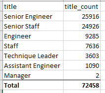

# Workforce Analysis for Pewlett Hackard

## Overview of the analysis: 
The purpose of this analysis is to understand the volume of potential upcoming retirements in order to adequately prepare organization for additional recruiting and hiring as well as knowledge transfer from retiring employees to new hires and those who remain at the organization.

## Results: 

- ~72.5K employees are ready for retirement.

- Higher level engineering positions will be hit the most.

    

- 1549 employees who are ready to retire are qualified to be mentors based on current executive guidelines of only including employees born in 1965; 

- Out of 72.5K retiring employees only two are managers.

## Summary: 

- As the "silver tsunami" begins to make an impact, approximately 72.5K positions will need to be back filled provided no other organizational or business changes take place. Given the impact, this might be a good time to assess organizational effectiveness and identify ways to improve/automate processes, thus reducing the number of positions that will need to be back filled. 

- The company needs to assess knowledge transfer needs and gaps focusing on process documentation and mentorship programs. With the current eligibility criteria for mentorship program, each qualified mentor will need to train on average 47 new employees, which is not sustainable. My recommendation would be to expand the eligibility criteria for inclusion into the mentorship program in addition to the organizational assessment which may help reduce the number of positions that need to be backfilled.

- Because higher levels of engineering are being hit most, one way to address the issue would be to look into upskilling and promotion opportunities for current employees in lower levels of engineering jobs vs back-filling all the positions from outside. Promoting from within can help boost employee morale and help save money as new hire incentives for lower levels tend to be lower as well.